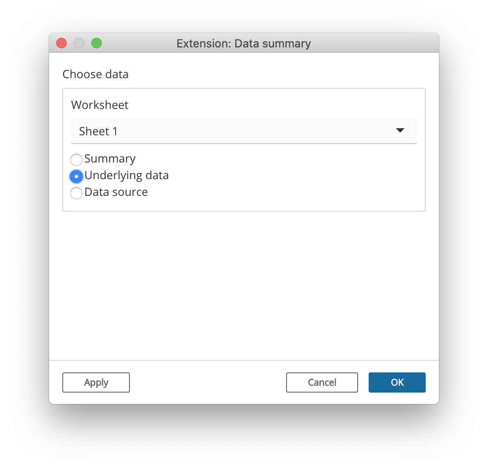

```{r include=FALSE}
library(ggplot2)
```

```{css echo=FALSE}
p>img:first-child:last-child {
  display: block;
  margin-left: auto;
  margin-right: auto;
  border: none;
}
video {
  display: block;
  padding: 0;
  border: 1px solid #AAA;
  margin: 1em auto;
  width: 100%;
  box-sizing: border-box;
}
```

<a name="datasummary"></a>Now that we've created an app that reads/writes settings, we're ready to take a big step forward and actually access a data table from Tableau. Our next example app will ask the Tableau dashboard author to choose a data table, and it will show a rich summary of each column of data, using the [summarytools](https://github.com/dcomtois/summarytools) R package.

{width="537"}

```{r code=readLines(system.file("examples/datasummary/app.R", package = "shinytableau")), eval=FALSE, results='hide'}
```

In order to understand how this example app works, we'll first need to look at how Tableau data is organized.

## Categories of data

Tableau's Extension API allows dashboard extensions, like the ones we're creating, to access data from the workbook they're embedded in. Actually, there's one big caveat to that: we can't access just *any* data, we can *only* access data via worksheets that are present in our same dashboard.

This means you can't start a new (empty) dashboard, put an extension object on it, and expect that extension object to be able to access any data. Instead, **you need to add one or more worksheets to the dashboard first**. Now, the extension object can access the data used by those worksheets.

Each worksheet makes three categories of data available to us:

1.  **Summary data:** The data in its final form before visualization. If the visualization aggregates measures, then the summary data contains the data after aggregation has been performed. If the worksheet has an active selection, then by default, only the selected data is returned (set the `ignoreSelection` option to `TRUE` to retrieve all data).

2.  **Underlying data:** The underlying data that is used in the visualization, before aggregation operations are performed but after tables are joined.

    By default, only the columns that are used in the worksheet are included (set `includeAllColumns` to `TRUE` if you need them all). If the worksheet has an active selection, then by default, only the selected data is returned (set the `ignoreSelection` option to `TRUE` to retrieve all data).

3.  **Data source:** You can also access the raw data from the data source(s) used by the worksheet. This data is unaffected by the worksheet settings. Tableau data sources are broken into one or more logical tables, like how a relational database has multiple tables.

As an R user, you may find this analogy based on the examples from [dplyr::mutate-joins] to be helpful in explaining the relationship between data source, underlying, and summary data:

    # Data source
    logical1 <- band_members
    logical2 <- band_instruments

    # Underlying is joined/selected, but not aggregated
    underlying <- band_members %>%
      full_join(band_instruments, by = "name") %>%
      select(band, name)

    # Summary is underlying plus aggregation
    summary <- underlying %>%
      group_by(band) %>%
      tally(name = "COUNT(name)")

The existence of these three levels of data granularity, plus the fact that the underlying and data source levels need additional specification to narrow down which of the multiple data tables at each level are desired, means that it's surprisingly complicated to specify what data you want:

(Deep breath...)

First, you need to identify the worksheet you care about. Then, whether you want summary, underlying, or data source data. If underlying, there may be more than one table involved, in which case you'll need to specify which one. If data source, there may be multiple data sources to choose from, and potentially more than one logical table per data source.

Don't worry, you don't need to remember all of that, because most of the time you'll just use...

## The `choose_data` module

Most shinytableau extensions are going to want to let the Tableau dashboard author choose the data they're interested in. Constructing the UI to lead the user through the above chain of decisions is complicated; therefore, we've done it for you by providing a `choose_data` Shiny module that you can use in your config dialogs.

{width="450"}

Like most [Shiny modules](https://shiny.rstudio.com/articles/modules.html), the `choose_data` module is actually two functions: a UI function, `choose_data_ui`; and a server function, `choose_data`. In the example above, they're invoked like this in the `config_ui`:

```{r eval=FALSE}
choose_data_ui("data_spec", "Choose data")
```

and this in the `config_server`:

```{r eval=FALSE}
data_spec <- choose_data("data_spec", iv = iv)
```

The `"data_spec"` string is just an id that needs to match between the two function calls. If you want to present multiple data choosers simultaneously, just call `choose_data_ui` and `choose_data` multiple times, using a different id for each pair of calls.

The return value of `choose_data`, which we've named `data_spec` here, is a reactive expression that returns a "spec" object, whose purpose we will discuss in a moment.

As the author of the extension, you may want to restrict the Tableau authors' choices to ones that make sense. For example, if your extension is only designed to work with underlying data and not summary or data source data, you can remove the latter choices using `choose_data_options`:

```{r eval=FALSE}
data_spec <- choose_data("data_spec",
  options = choose_data_options(aggregation = "underlying"),
  iv = iv)
```

Once the user has confirmed their choice, this extension saves the resulting spec as a setting:

```{r eval=FALSE}
save_settings <- function() {
  update_tableau_settings_async(
    data_spec = data_spec()
  )
}
```

Note that we want to persist the *value* of the `data_spec` reactive expression, so we call it like a function: `data_spec()`.

## Accessing a data table

We turn our attention now to consuming data, using the `reactive_tableau_data()` function. This function is called from the `server` and `config_server` functions, and returns a reactive expression that can be used to access the actual data (though there are complications in actually getting the data, more on this below).

### Calling `reactive_tableau_data()`

The first argument you need to pass to `reactive_tableau_data()` is `spec`; it specifies what data you're looking for, and you can provide it in a number of ways.

1.  You can pass **the `data_spec` reactive expression returned from `choose_data()`**. This approach should be used when you want your config dialog to show a real-time preview of the choices returned by `choose_data`.

    ``` {.r}
    data_spec <- choose_data("data_spec")
    df <- reactive_tableau_data(data_spec)
    ```

    Note that we're not passing `data_spec()`, but `data_spec`. This is because we want to pass not just a *snapshot* of the user's choices, but to give this `reactive_tableau_data` access to the current *and future* choices.

2.  You can pass **the name of a setting** where a spec object has been persisted. This approach is what you're generally going to want to do from `server`.

    From the example above:

    ``` {.r}
    df <- reactive_tableau_data("data_spec")
    ```

    (This is essentially a shorthand for `reactive_tableau_data(reactive(tableau_setting("data_spec"))))`, which is a construction so awkward that, even now, it's difficult for me to not delete this sentence.)

3.  Finally, you can construct a spec object **from scratch** using one of the `spec_summary()`, `spec_underlying()`, or `spec_datasource()` functions. You'll need to provide the name of the worksheet/underlying table/etc. This could be useful for extensions that are created specifically for a particular dashboard.

### Using the return value

The value returned by `reactive_tableau_data` has a couple of complications. Let's look again at the `server` of our data summary example extension (where `df` is the `reactive_tableau_data` return value):

```{r eval=FALSE}
df() %...>%
  dfSummary(varnumbers = FALSE, valid.col = FALSE, graph.magnif = 0.8) %...>%
  print(method = "render", headings = TRUE, bootstrap.css = FALSE)
```

First, because it's a reactive expression, `df` needs to be called like a function if you want to access its value. This is par for the course when writing a Shiny app.

Second, the value returned by `df()` is still not the data frame object we're trying to get to. Instead, it's a **promise object**, from the [promises package](https://rstudio.github.io/promises/). Promises operate quite contrary to the normal programmer's intuition, so if this is your first exposure to promises and asynchronous programming, it's imperative that you read at least the [introduction](https://rstudio.github.io/promises/articles/intro.html) and [overview](https://rstudio.github.io/promises/articles/overview.html) vignettes.

For simple pipelines like the above, you can replace `%>%` with `%...>%` and it will generally work. If you need to reference the data frame multiple times, as one often does, then you can use this form:

```{r eval=FALSE}
df() %>% then(function(actual_data_frame) {
  # Do various things with actual_data_frame
})
```

(Please change `actual_data_frame` to whatever variable name is suitable for your app.)

::: {.nextstep}
**Next step:** [Putting it all together](example.html)
:::
