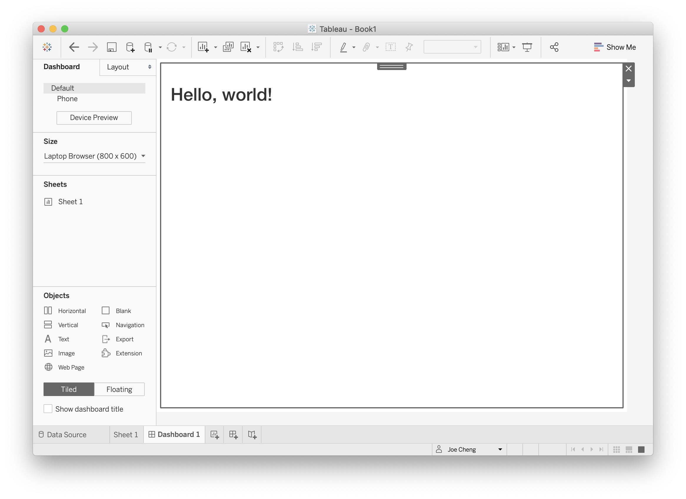
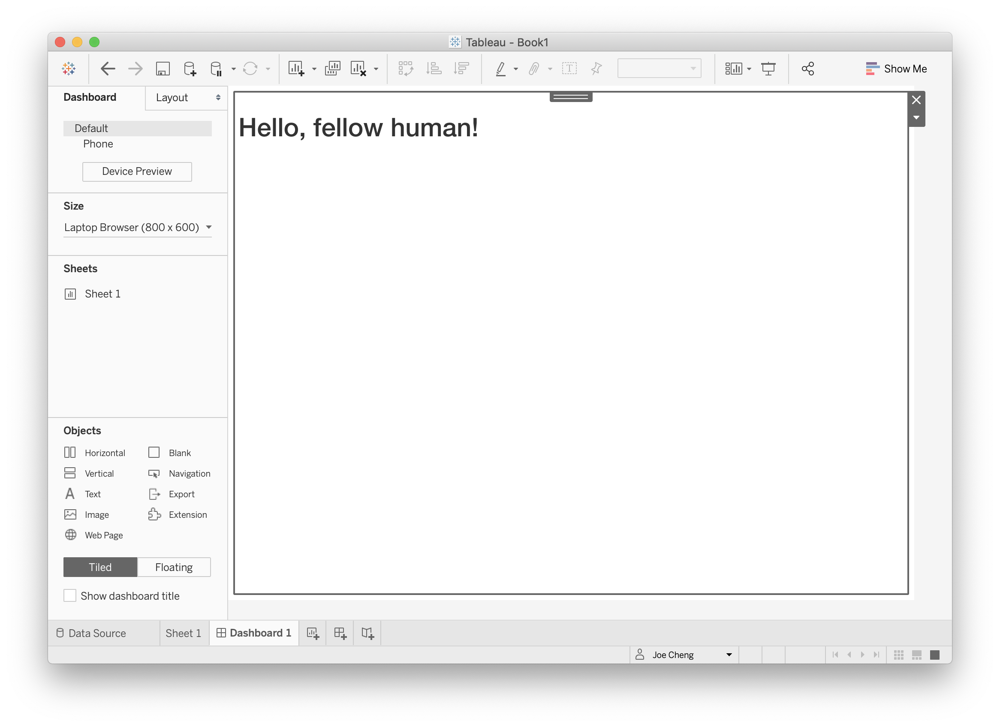

```{r include=FALSE}
library(ggplot2)
```

```{css echo=FALSE}
@import url('https://fonts.googleapis.com/css2?family=Open+Sans&display=swap');

body {
  font-family: "Open Sans", sans-serif;
  font-size: 12pt;
  line-height: 1.5;
}
```

Tableau version 2020.3 introduced a new extensibility feature called Dashboard Extensions. This feature lets programmers use JavaScript to create custom objects that normal Tableau users can drop into their Tableau dashboard layouts, providing custom visualizations and interactive features beyond Tableau's native capabilities.

The {shinytableau} package allows you to easily create Tableau dashboard extensions using the power of R and Shiny. In typical Shiny fashion, it's not necessary to know web technologies like HTML, JavaScript, and CSS to create compelling Tableau extensions.

## Example: Violin plot

At the time of this writing, Tableau doesn't have built-in support for [violin plots](https://en.wikipedia.org/wiki/Violin_plot), only [box plots](https://help.tableau.com/current/pro/desktop/en-us/buildexamples_boxplot.htm). While box plots are more familiar, violin plots are more informative because they show you the entire distribution instead of merely quartiles. For example, the plots below show TODO:

I would be remiss not to mention the heroics that Tableau consultant Gwilym Lockwood went through to [create a violin plot in Tableau](https://gwilymlockwood.com/2018/07/03/language-sex-violins-other-how-to-create-violin-plots-in-tableau/). The blog post is worth a read, but the takeaway is that you'd have to *really* want a violin plot to go through all of those steps.

In R, on the other hand, there are several packages that provide violin plots; a cursory search turned up [vioplot](https://cran.r-project.org/web/packages/vioplot/vignettes/violin_customisation.html), [plotly](https://plotly.com/r/violin/), [ggpubr](https://rpkgs.datanovia.com/ggpubr/reference/ggviolin.html), and [ggplot2](https://ggplot2.tidyverse.org/reference/geom_violin.html). Here's how you might create a violin plot in ggplot2, using the `mtcars` data set, showing the horsepower (`hp`) distribution for each cylinder count (`cyl`):

```{r warning=FALSE,fig.width=5,fig.height=4}
ggplot(mtcars, aes(x = factor(cyl), y = hp)) +
  geom_violin()
```

With shinytableau, we can wrap this R code into an easy-to-use Tableau dashboard extension that can be used by Tableau users that don't even know what R is. They don't need to modify the code to point to the data source and variables they want to plot, because you're going to provide them with a GUI for that. They don't need to think about how to configure R on their server, because you can deploy it just once for all users of the extension.

Take a look at what it's like to use a shinytableau extension:

(screencast)

To recap:

1.  Navigate to the shinytableau extension's info page and click Download to save a .trex file to your hard drive.
2.  In a Tableau dashboard, drag an Extension object from the sidebar to the dashboard.
3.  Select "My Extensions", and choose the .trex file you just downloaded. (It's now safe to delete that .trex file, or keep it for the next time you want to install that extension.)
4.  Choose "Configure" from the down-arrow menu from the border of the extension object.

You (and other Tableau users) can use the same shinytableau extension across multiple dashboards. And just as a single Tableau dashboard can contain multiple (e.g.) bar chart sheets, each with its own view of the data, you can also have one shinytableau extension appear multiple times in a dashboard, with each instance configured differently.

We'll come back to violin plots later, but let's look at some much simpler examples first.

## Writing your first extension

Put simply, a shinytableau extension is a specially structured Shiny app. (If you haven't written a Shiny app before, you're *definitely* going to want to go through the [Shiny tutorial](https://shiny.rstudio.com/tutorial/), at the very least, before attempting to go further with shinytableau.)

Let's start by creating the simplest possible Tableau extension: one that will display the string `"Hello, world!"`. First, create a new, empty RStudio project (File \| New Project... \| New Directory \| New Project).

Then call:

``` {.r}
shinytableau::yaml_skeleton()
```

This will create an example `manifest.yml` file in your project, which controls the metadata that is displayed to Tableau users when they install the extension.

Besides the obvious fields like name, description, and author, you'll also want to change the `extension_id` to a value unlikely to be used by anyone else, e.g. replacing `com.example` with your company's [reverse domain name](https://en.wikipedia.org/wiki/Reverse_domain_name_notation).

Next, create a file called `app.R` in this directory, and make it look like the following:

```{r code=readLines(system.file("examples/tutorial-1/app.R", package = "shinytableau")), eval=FALSE, results='hide'}
```

If you've written a Shiny app before, this code should look comfortingly familiar. The main differences are the `manifest` object, the `ui` being wrapped in `function(req) {...}` (optional in a regular Shiny app, but mandatory here), and where the last line is usually `shinyApp(ui, server)` we instead have `tableau_extension(manifest, ui, server)`.

There are two other small differences worth noting. First, the file starts with the comment `# filetype: shinyApp`; this is a hint to the RStudio IDE that even though the file doesn't look like a Shiny app (because it doesn't end with `shinyApp(ui, server)`), it actually is. Second, the call to `tableau_extension` includes a hardcoded port number. For local development purposes, it's a good idea to hardcode the port to a unique value (between 1025 and 49151) for each extension.

Now, press Ctrl+Shift+Enter (or Cmd+Shift+Return on Mac) and you should see the info page for this extension appear. Download the .trex file, drag an Extension onto a Tableau dashboard, choose the .trex file, and you should see "Hello, world!" in your dashboard.

{width="573"}

## Adding configuration settings

Now we'll see how configuration works by making our tiny extension only slightly more complex: instead of showing the hardcoded string "Hello, world!" we'll allow the dashboard author to specify who is being greeted.

We will use a configuration dialog to prompt the dashboard author for the greetee[^1], save their input as a setting called `"greetee"`, and have the extension use that setting to dynamically render the greeting.

[^1]: Yes, it's a [real word](https://en.wiktionary.org/wiki/greetee)!

```{r code=readLines(system.file("examples/tutorial-2/app.R", package = "shinytableau")), eval=FALSE, results='hide'}
```

If your RStudio session is still running the previous version of the code we wrote, stop it now by either clicking in the Console pane and hitting Escape, or pressing the stop-sign icon in the Console toolbar. Then run the new code with Ctrl+Shift+Enter/Cmd+Shift+Return.

You should see something like the following screenshot: the extension object shows only the name of the extension, and a message that you need to configure the extension.

{width="573"}

Clicking Configure shows a text input:

{width="421"}

Type in a value and click OK, and you should see the extension object instantly update to reflect your change.

{width="573"}

Compared to the "Hello, World!" version, we've made a number of important changes.

Most obviously, we now have `config_ui` and `config_server`, which together represent the configuration dialog. These two variables are passed to `tableau_extension` as the next two arguments after `ui` and `server`.

The job of `config_ui`/`config_server` is to take input about the user's preferences (in this case, what message should be displayed), and save them as *settings*. Each extension instance has its own set of settings; that is, if the same extension is dropped on a dashboard three times, then there are three extension instances, each with their own completely independent config dialogs and settings.

There are several essential requirements for `config_ui` and `config_server` that you need to know about.

#### config\_ui

As we said about `ui` above, `config_ui` needs to be a `function(req) { ... }` that returns some UI object, not just the UI object itself as you can do in a normal Shiny app.

Also, most Shiny `ui` (including shinytableau ones) should have a `fluidPage`, `fillPage`, or other page function as their outermost call, but this isn't the case with `config_ui`. The UI you return from `config_ui` will be inserted into a configuration dialog UI that shinytableau creates for you. So instead of `fillPage()`, use `tagList()`.

```{r eval=FALSE}
config_ui <- function(req) {
  tagList(
    textInput("greetee", "Whom would you like to greet?", "world")
  )
}
```

#### config\_server

There are two new requirements for `config_server` versus a regular `server`. First, a normal Shiny `server` is a function that takes `input`, `output`, and `session` arguments; a `config_server` takes an additional `iv` argument. This represents an `InputValidator` object from the [shinyvalidate](https://rstudio.github.io/shinyvalidate/articles/shinyvalidate.html) package. You use `iv` to tell shinytableau which user inputs *must* be provided, and any validation rules that must be enforced. Any required inputs that are missing, or failing validation rules, will display errors in the form and prevent the OK and Apply buttons from taking effect.

Second, a `config_server` function must declare a `save_settings` function, and must return this function. This is in contrast to regular Shiny server functions, which do not return anything[^2]. The `save_settings` function should take no arguments and, when called, should call [`update_tableau_settings_async`](https://rstudio.github.io/shinytableau/reference/update_tableau_settings_aync.html) to persist whatever settings the user has specified. In this case, we're taking the user input, `input$greetee`, and persisting that as a setting named `greetee`.

[^2]: Although Shiny *module* server functions often do return objects to their callers.

```{r eval=FALSE}
config_server <- function(input, output, session, iv) {
  # Ensure that the user provides a value for input$greetee
  iv$add_rule("greetee", sv_required())

  # config_server must have a save_settings function
  save_settings <- function() {
    update_tableau_settings_async(
      greetee = input$greetee
    )
  }
  
  # config_server must always return the save_settings function
  return(save_settings)
}
```

(Advanced R users may be wondering if, rather than declaring and returning `save_settings`, simply having an anonymous function as the last expression would be sufficient. Yes, that works, but doing it the recommended way makes the intent more immediately obvious.)

The values you pass to `update_tableau_settings_async()` will be saved as JSON objects, so it's a good idea to keep things simple: atomic numeric, character, and logical vectors are safe to use, as are unnamed and named lists. `NULL` is fine too. It's not a good idea to save more specialized objects like factors, data frames, environments, R6 objects. Even Date objects should probably be converted to character first, and parsed back into a Date by whomever is reading the setting.

Speaking of reading settings...

### Reading settings

Now that we've discussed how `config_ui` and `config_server` can let you write settings, we can talk about the much simpler topic of how to read settings from the extension object (i.e. `server`).

The main way you'll access settings is by calling `tableau_setting(setting_name)`, e.g. `tableau_setting("greetee")` in the example above. The important thing to note is that `tableau_setting` performs a *reactive* read, so whomever is doing the reading (i.e. reactive expression, reactive observer, or reactive output) will be triggered when the setting changes.

You can call `tableau_settings_all()` to retrieve all of the current settings as a list. Generally you should try to use `tableau_setting` in favor of `tableau_settings_all`, because the latter takes a reactive dependency on *all* of the settings, even if you're not actually interested in all of them.

## Accessing data from Tableau

Now that we've created an app that reads/writes settings, we're ready to take a big step forward and actually access a data table from Tableau. Our next example app will ask the Tableau dashboard author to choose a data table, and it will show a rich summary of each column of data, using the [summarytools](https://github.com/dcomtois/summarytools) R package.

TODO screencast or screenshots

```{r eval=FALSE}
# filetype: shinyApp

library(shiny)
library(shinytableau)
library(promises)
library(summarytools)

manifest <- tableau_manifest_from_yaml()

ui <- function(req) {
  fluidPage(
    fluidRow(
      column(12,
        uiOutput("summary")
      )
    )
  )
}

server <- function(input, output, session) {
  df <- reactive_tableau_data("data_spec")

  output$summary <- renderUI({
    # From https://cran.r-project.org/web/packages/summarytools/vignettes/Introduction.html#creating-shiny-apps
    df() %...>%
      dfSummary(varnumbers = FALSE, valid.col = FALSE, graph.magnif = 0.8) %...>%
      print(method = "render", headings = TRUE, bootstrap.css = FALSE)
  })
}

config_ui <- function(req) {
  tagList(
    choose_data_ui("data_spec", "Choose data")
  )
}

config_server <- function(input, output, session, iv) {
  data_spec <- choose_data("data_spec", iv = iv)

  save_settings <- function() {
    update_tableau_settings_async(
      data_spec = data_spec()
    )
  }
  return(save_settings)
}

tableau_extension(manifest, ui, server, config_ui, config_server,
  options = ext_options(port = 4567)
)
```

In order to understand how this example app works, we'll first need to look at how Tableau data is organized.

### Categories of data

Tableau's Extension API allows dashboard extensions, like the ones we're creating, to access data from the workbook they're embedded in. Actually, there's one big caveat to that: we can't access just *any* data, we can *only* access data via worksheets that are present in our same dashboard.

This means you can't start a new (empty) dashboard, put an extension object on it, and expect that extension object to be able to access any data. Instead, **you need to add one or more worksheets to the dashboard first**. Now, the extension object can access the data used by those worksheets.

Each worksheet makes three categories of data available to us:

1.  **Summary data:** The data in its final form before visualization. If the visualization aggregates measures, then the summary data contains the data after aggregation has been performed. If the worksheet has an active selection, then by default, only the selected data is returned (set the `ignoreSelection` option to `TRUE` to retrieve all data).

2.  **Underlying data:** The underlying data that is used in the visualization, before aggregation operations are performed but after tables are joined.

    By default, only the columns that are used in the worksheet are included (set `includeAllColumns` to `TRUE` if you need them all). If the worksheet has an active selection, then by default, only the selected data is returned (set the `ignoreSelection` option to `TRUE` to retrieve all data).

3.  **Data source:** You can also access the raw data from the data source(s) used by the worksheet. This data is unaffected by the worksheet settings. Tableau data sources are broken into one or more logical tables, like how a relational database has multiple tables.

As an R user, you may find this analogy based on the examples from [dplyr::mutate-joins] to be helpful in explaining the relationship between data source, underlying, and summary data:

    # Data source
    logical1 <- band_members
    logical2 <- band_instruments

    # Underlying is joined/selected, but not aggregated
    underlying <- band_members %>%
      full_join(band_instruments, by = "name") %>%
      select(band, name)

    # Summary is underlying plus aggregation
    summary <- underlying %>%
      group_by(band) %>%
      tally(name = "COUNT(name)")

The existence of these three levels of data granularity, plus the fact that the underlying and data source levels need additional specification to narrow down which of the multiple data tables at each level are desired, means that it's surprisingly complicated to specify what data you want:

(Deep breath...)

First, you need to identify the worksheet you care about. Then, whether you want summary, underlying, or data source data. If underlying, there may be more than one table involved, in which case you'll need to specify which one. If data source, there may be multiple data sources to choose from, and potentially more than one logical table per data source.

Don't worry, you don't need to remember all of that.

Most shinytableau extensions are going to want to let the Tableau dashboard author choose the data they're interested in. Constructing the UI to lead the user through the above chain of decisions is complicated; therefore, we've done it for you by providing a `choose_data` Shiny module that you can use in your config dialogs.

### The `choose_data` module

Like most [Shiny modules](https://shiny.rstudio.com/articles/modules.html), the `choose_data` module is actually two functions: a UI function, `choose_data_ui`; and a server function, `choose_data`. In the example above, they're invoked like this in the `config_ui`:

```{r eval=FALSE}
choose_data_ui("data_spec", "Choose data")
```

and this in the `config_server`:

```{r eval=FALSE}
data_spec <- choose_data("data_spec", iv = iv)
```

The `"data_spec"` string is just an id that needs to match between the two function calls. If you want to present multiple data choosers simultaneously, just call `choose_data_ui` and `choose_data` multiple times, using a different id for each pair of calls.

The return value of `choose_data`, which we've named `data_spec` here, is a reactive expression that returns a "spec" object, whose purpose we will discuss in a moment.

As the author of the extension, you may want to restrict the Tableau authors' choices to ones that make sense. For example, if your extension is only designed to work with underlying data and not summary or data source data, you can remove the latter choices using `choose_data_options`:

```{r eval=FALSE}
data_spec <- choose_data("data_spec",
  options = choose_data_options(aggregation = "underlying"),
  iv = iv)
```

Once the user has confirmed their choice, this extension saves the resulting spec as a setting:

```{r eval=FALSE}
save_settings <- function() {
  update_tableau_settings_async(
    data_spec = data_spec()
  )
}
```

Note that we want to persist the *value* of the `data_spec` reactive expression, so we call it like a function: `data_spec()`.

### Accessing a data table

We turn our attention now to consuming data, using the `reactive_tableau_data()` function. This function is called from the `server` and `config_server` functions, and returns a reactive expression that can be used to access the actual data (though there are complications in actually getting the data, more on this below).

#### Calling `reactive_tableau_data()`

The first argument you need to pass to `reactive_tableau_data()` is `spec`; it specifies what data you're looking for, and you can provide it in a number of ways.

1.  You can pass **the `data_spec` reactive expression returned from `choose_data()`**. This approach should be used when you want your config dialog to show a real-time preview of the choices returned by `choose_data`.

    ``` {.r}
    data_spec <- choose_data("data_spec")
    df <- reactive_tableau_data(data_spec)
    ```

    Note that we're not passing `data_spec()`, but `data_spec`. This is because we want to pass not just a *snapshot* of the user's choices, but to give this `reactive_tableau_data` access to the current *and future* choices.

2.  You can pass **the name of a setting** where a spec object has been persisted. This approach is what you're generally going to want to do from `server`.

    From the example above:

    ``` {.r}
    df <- reactive_tableau_data("data_spec")
    ```

    (This is essentially a shorthand for `reactive_tableau_data(reactive(tableau_setting("data_spec"))))`, which is a construction so awkward that, even now, it's difficult for me to not delete this sentence.)

3.  Finally, you can construct a spec object **from scratch** using one of the `spec_summary()`, `spec_underlying()`, or `spec_datasource()` functions. You'll need to provide the name of the worksheet/underlying table/etc. This could be useful for extensions that are created specifically for a particular dashboard.

#### Using the return value

The value returned by `reactive_tableau_data` has a couple of complications. Let's look again at the `server` of our data summary example extension (where `df` is the `reactive_tableau_data` return value):

```{r eval=FALSE}
df() %...>%
  dfSummary(varnumbers = FALSE, valid.col = FALSE, graph.magnif = 0.8) %...>%
  print(method = "render", headings = TRUE, bootstrap.css = FALSE)
```

First, because it's a reactive expression, `df` needs to be called like a function if you want to access its value. This is par for the course when writing a Shiny app.

Second, the value returned by `df()` is still not the data frame object we're trying to get to. Instead, it's a **promise object**, from the [promises package](https://rstudio.github.io/promises/). Promises operate quite contrary to the normal programmer's intuition, so if this is your first exposure to promises and asynchronous programming, it's imperative that you read at least the [introduction](https://rstudio.github.io/promises/articles/intro.html) and [overview](https://rstudio.github.io/promises/articles/overview.html) vignettes.

For simple pipelines like the above, you can replace `%>%` with `%...>%` and it will generally work. If you need to reference the data frame multiple times, as one often does, then you can use this form:

```{r eval=FALSE}
df() %>% then(function(actual_data_frame) {
  # Do various things with actual_data_frame
})
```

(Please change `actual_data_frame` to whatever variable name is suitable for your app.)

## Full ggviolin example

Armed with the knowledge from the previous sections, we can now build the ggviolin shinytableau extension. Structurally, this will be very close to the Data Summary extension from the previous section, but the ggviolin extension makes use of additional features from Shiny itself.

The preamble is the same, with the addition of `library(ggplot2)`:

```{r eval=FALSE}
# filetype: shinyApp

library(shiny)
library(shinytableau)
library(promises)
library(shinyvalidate)
library(ggplot2)

manifest <- tableau_manifest_from_yaml()
```

The dashboard view's UI differs in that it uses `fillPage`, and notice that the plot's height is explicitly set to 100%. We also define a brush.

```{r eval=FALSE}
ui <- function(req) {
  fillPage(
    plotOutput("plot", height = "100%",
      brush = brushOpts("plot_brush", resetOnNew = TRUE)
    )
  )
}
```

The dashboard view's server function uses a function we haven't discussed before, `tableau_select_marks_by_brush_async`. This does exactly what the name implies: using the selection defined from a `plotOutput` brush, it drives selection on a Tableau worksheet. (This function has several limitations, including only working with ggplot2-based plots and only when the plot and the worksheet in question have their dimensions in common; see the `?tableau_select_marks_by_brush_async` help topic for more details.)

Note also that `tableau_setting()` is called to retrieve `plot_title`, `xvar`, and `yvar` settings; we'll be saving those settings in the config dialog. When writing your own ggplot2 extensions that let the user select what column to map to certain aesthetics, you'll want to follow the pattern shown below, where the character vector (e.g. `xvar`) is passed to `aes()` using `!!as.symbol(...)`.

```{r eval=FALSE}
server <- function(input, output, session) {
  df <- reactive_tableau_data("data_spec")

  observeEvent(input$plot_brush, {
    worksheet <- req(tableau_setting("data_spec")$worksheet)
    tableau_select_marks_by_brush_async(worksheet, input$plot_brush)
  })

  output$plot <- renderPlot({
    plot_title <- tableau_setting("plot_title")
    xvar <- tableau_setting("xvar")
    yvar <- tableau_setting("yvar")

    df() %...>% {
      ggplot(., aes(x = !!as.symbol(xvar), y = !!as.symbol(yvar))) +
        geom_violin(draw_quantiles = c(0.25, 0.5, 0.75)) +
        ggtitle(plot_title)
    }
  })
}
```

The ggviolin config dialog uses the `choose_data` module, just as the Data Summary example did. It also prompts the user for a title, creates a `uiOutput` (that we'll populate with xvar and yvar select inputs), and previews the selected data table using `tableOutput`.

```{r eval=FALSE}
config_ui <- function(req) {
  tagList(
    textInput("title", "Title"),
    choose_data_ui("data", "Choose data"),
    uiOutput("var_selection_ui"),
    tableOutput("preview")
  )
}
```

The config dialog's server function is the most complicated piece. We'll take it a chunk at a time. In the beginning of the function, [shinyvalidate validation rules](https://rstudio.github.io/shinyvalidate/articles/shinyvalidate.html) are added, which ensure that the user provides these values before settings can be saved.

```{r eval=FALSE}
config_server <- function(input, output, session, iv) {
  iv$add_rule("title", sv_required())
  iv$add_rule("xvar", sv_required())
  iv$add_rule("yvar", sv_required())
```

Next, we invoke the `choose_data()` module, passing in the same `"data"` id that we just passed to `choose_data_ui()` a few moments ago.

```{r eval=FALSE}
  data_spec <- choose_data("data", iv = iv)
```

For the ggviolin extension, not only do we want to save this data spec to the settings, we actually need to use it immediately:

First, for preview purposes, we want the first five rows of the selected table, and we use `reactive_tableau_data` for this.

```{r eval=FALSE}
  data <- reactive_tableau_data(data_spec, options = list(maxRows = 5))

  output$preview <- renderTable({
    data()
  })
```

Second, for letting the user choose which of the selected table's columns should map to the x and y dimensions, we need the schema (which contains the fieldnames, among other things), and we use `reactive_tableau_schema` to get it.

Like `reactive_tableau_data`, the return value for `reactive_tableau_schema` is a reactive expression; but unlike `reactive_tableau_data`, this reactive expression is not asynchronous (doesn't return a promise), so there's no need to worry about using `%...>%`.

```{r eval=FALSE}
  schema <- reactive_tableau_schema(data_spec)

  output$var_selection_ui <- renderUI({
    tagList(
      selectInput("xvar", "Dimension", schema()$columns$fieldName),
      selectInput("yvar", "Measure", schema()$columns$fieldName)
    )
  })
```

Finally, we fulfill the final basic requirement for config server functions: we define and return the function that saves the user's input to Tableau settings.

```{r eval=FALSE}
  save_settings <- function() {
    update_tableau_settings_async(
      plot_title = input$title,
      data_spec = data_spec(),
      xvar = input$xvar,
      yvar = input$yvar
    )
  }
  return(save_settings)
}
```

All that's left now is to hand all of these pieces over to `tableau_extension`.

```{r eval=FALSE}
tableau_extension(
  manifest, ui, server, config_ui, config_server,
  options = ext_options(config_width = 600, config_height = 600, port = 2468)
)
```

## UI considerations: Dashboard view

When creating the `ui` for an extension, you use the same technology and techniques as when creating the `ui` for a regular Shiny app. But unlike most Shiny apps, the entire UI will be embedded in a rectangle on a dashboard, so some different user experience considerations come into play.

### Filling available space

For one thing, it's common for dashboard tiles to be 1/4 screen size, or even smaller. When screen real estate is in such short supply, it's important for shinytableau extensions to make the most of the area they have. A typical [`fluidPage`/`sidebarLayout` arrangement](http://shiny.rstudio-staging.com/tutorial/written-tutorial/lesson2/) is not going to be optimal here.

If your extension's purpose is to display a visualization that is amenable to fluid resizing---a plot or map, for instance---then you should generally fill the available space. You can achieve this by using [`fillPage`](https://shiny.rstudio.com/reference/shiny/latest/fillPage.html) as your outermost UI element, and be sure to also set the height of your visualization to `height="100%"` (which is supported by `plotOutput` and most HTML widgets):

```{r eval=FALSE}
ui <- function(req) {
  fillPage(
    plotOutput("plot", height = "100%")
  )
}
```

If you want to divide the space between multiple visualizations, while still filling the available space, you can use [`fillRow` or `fillCol`](https://shiny.rstudio.com/articles/gadget-ui.html#fillrowfillcol) as the direct child of `fillPage`.

### Scrollable extensions

Some shinytableau extensions will not be suitable for filling the available space, as in our Data Summary example (TODO: link). This is because the extension's UI does not have a naturally fluid height; it's simply a table of data, that has its own strong opinion about what height it needs based on its content.

For such situations, we go back to using `fluidPage` page, which will automatically display a vertical scrollbar if one is necessary.

```{r eval=FALSE}
ui <- function(req) {
  fluidPage(
    uiOutput("summary")
  )
}
```

If your `fluidPage`-based layout includes `plotOutput` or HTML Widget outputs, you will not be able to use `height="100%"` as we did in the previous section; instead, you will need to either accept the default height or provide a number of pixels.

## Deployment and hosting

So far, we've been running our shinytableau extensions locally from within RStudio. Needless to say, this isn't a suitable deployment strategy for putting extensions into production---you don't want Tableau dashboards to stop working just because you closed your laptop and went home!

Deploying shinytableau extensions is *mostly* no different than deploying any other kind of Shiny app. The three main options offered by RStudio are:

1.  **ShinyApps.io** for cloud hosting of Shiny apps. This is definitely the easiest to get started, as there's no software to install and configure, and you deploy your app by clicking a button in the RStudio IDE. Free and paid plans are available.

2.  **Shiny Server** is our open-source solution for on-premises deployment. A Linux server is required, and you'll need to install R and any R packages used by your Shiny apps. Deployment of apps is performed by copying files to the server and editing config files (similar to Nginx or Apache).

3.  **RStudio Connect** is our flagship publishing platform. With RStudio Connect, you can share Shiny applications, R Markdown reports, dashboards, plots, and more in one convenient place. Like ShinyApps.io, Shiny apps are deployed with push-button publishing from the RStudio IDE

### Authentication

Authentication for shinytableau extensions is a bit more complicated than that of regular Shiny apps, and several different factors must be considered to balance your security needs with a smooth end-user experience. (Note that ShinyApps.io and RStudio Connect offer built-in support for authentication, but Shiny Server Open Source does not.)

The first question to consider is **whether your shinytableau extension needs authentication** at all. We anticipate that many or most shinytableau extensions will not have direct access to their own data, but instead read the data from the Tableau dashboard's worksheets. If that is the case, and there's no danger in having an unauthorized or even malicious user embedding the shinytableau extension in their own Tableau dashboard, then consider allowing anonymous access to your deployed extension. This will sidestep most of the issues in this section.

Second, it's important to note that **Safari 13.1 and newer prevent shinytableau authentication from working** (this only affects Tableau Server and Tableau Online, not Tableau Desktop). This is because shinytableau extensions run within an `<iframe>`, and will generally run on a different domain than the enclosing page (the Tableau dashboard); this configuration results in our authentication cookies being considered *third-party cookies*, which Safari 13.1 [aggressively blocks](https://webkit.org/blog/10218/full-third-party-cookie-blocking-and-more/). At the time of this writing, we do not have a solution for this problem, other than to ask users to turn off Safari 13.1's third-party cookie blocking by going into Preferences \| Privacy and unchecking "Prevent cross-site tracking". Unfortunately, this preference cannot be set on a per-site basis.

Third, embedded auth flow TODO

Fourth, load balancing cookie TODO
