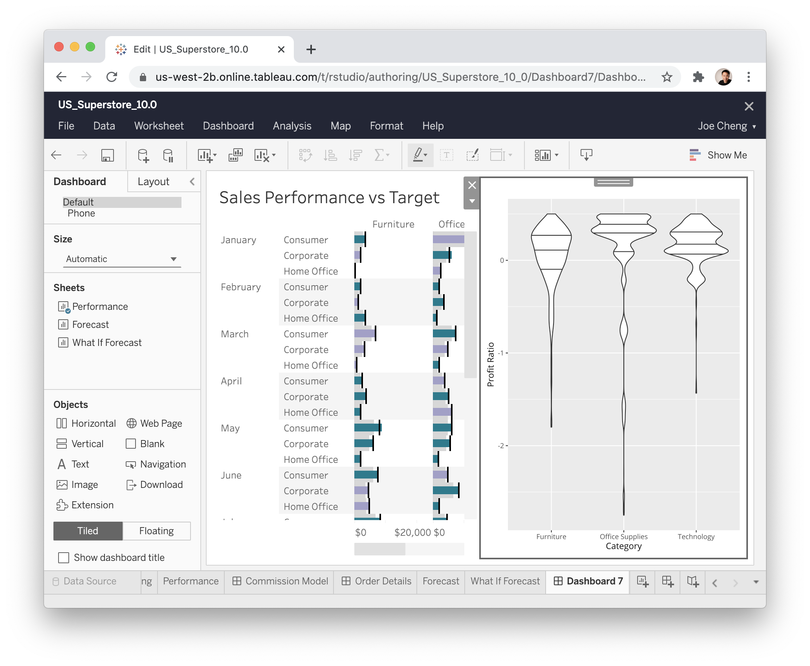

```{r include=FALSE}
library(ggplot2)
```

The {shinytableau} package allows you to easily extend Tableau dashboards using the power of R and Shiny. In typical Shiny fashion, it's not necessary to know web technologies like HTML, JavaScript, and CSS to create compelling Tableau extensions.

Tableau version 2020.3 introduced a new extensibility feature called Dashboard Extensions. This feature lets programmers use JavaScript to create custom objects that normal Tableau users can drop into their Tableau dashboard layouts, providing custom visualizations and interactive features beyond Tableau's native capabilities. The shinytableau package is a bridge between the JavaScript-based Tableau Dashboard Extension API, and Shiny code that you as an R practitioner will write. The resulting app can be used easily by Tableau dashboard authors, who don't need to know anything about R or Shiny.

## Motivating example: Violin plot

Tableau doesn't have built-in support for [violin plots](https://ggplot2.tidyverse.org/reference/geom_violin.html), only [boxplots](https://ggplot2.tidyverse.org/reference/geom_boxplot.html). While boxplots are more familiar, violin plots are more informative because they show you the entire distribution instead of merely quartiles. For example, take a look at the same data drawn as a boxplot (left) and a violin plot (right):

```{r echo=FALSE,eval=FALSE}
# Don't execute during knit patchwork isn't yet on CRAN
library(patchwork)
no_x_axis <- theme_void()
p1 <- ggplot(faithful, aes(x = 1, y = waiting)) + geom_boxplot() + xlab("") + no_x_axis
p2 <- ggplot(faithful, aes(x = 1, y = waiting)) + geom_violin(draw_quantiles = c(0.25, 0.5, 0.75)) + no_x_axis
p1 + p2
```


The boxplot doesn't give any hint that these values follow a bimodal distribution, while the violin plot makes it clear.

I would be remiss not to mention the heroics that Tableau consultant Gwilym Lockwood went through to [create a violin plot in Tableau](https://gwilymlockwood.com/2018/07/03/language-sex-violins-other-how-to-create-violin-plots-in-tableau/). The blog post is worth a read, but the takeaway is that you'd have to *really* want a violin plot to go through all of those steps.

In R, on the other hand, there are several packages that provide violin plots; a cursory search turned up [vioplot](https://cran.r-project.org/web/packages/vioplot/vignettes/violin_customisation.html), [plotly](https://plotly.com/r/violin/), [ggpubr](https://rpkgs.datanovia.com/ggpubr/reference/ggviolin.html), and [ggplot2](https://ggplot2.tidyverse.org/reference/geom_violin.html). Here's how you might create a violin plot in ggplot2, using the `mtcars` data set, showing the horsepower (`hp`) distribution for each cylinder count (`cyl`):

```{r warning=FALSE,fig.width=5,fig.height=4}
ggplot(mtcars, aes(x = factor(cyl), y = hp)) +
  geom_violin()
```

With shinytableau, we can wrap this R code into an easy-to-use Tableau dashboard extension that can be used by Tableau users that don't even know what R is. They don't need to modify the code to point to the data source and variables they want to plot, because you're going to provide them with a GUI for that. They don't need to think about how to configure R on their server, because you can deploy it just once for all users of the extension.

{width="573"}

Take a look at what it's like to use a shinytableau extension:

```{=html}
<video controls>
<source src="shinytableau-captioned.webm" type="video/webm"/>
<source src="shinytableau-captioned.mp4" type="video/mp4"/>
</video>
```
To recap:

1.  Navigate to the shinytableau extension's info page and click Download to save a .trex file to your hard drive.
2.  In a Tableau dashboard, drag an Extension object from the sidebar to the dashboard.
3.  Select "My Extensions", and choose the .trex file you just downloaded. (It's now safe to delete that .trex file, or keep it for the next time you want to install that extension.)
4.  Choose "Configure" from the down-arrow menu from the border of the extension object.

You (and other Tableau users) can use the same shinytableau extension across multiple dashboards. And just as a single Tableau dashboard can contain multiple (e.g.) bar chart sheets, each with its own view of the data, you can also have one shinytableau extension appear multiple times in a dashboard, with each instance configured differently.

We'll come back to violin plots later, but let's look at some much simpler examples first.

::: {.nextstep}
**Next step:** [Writing your first extension](helloworld.html)
:::
